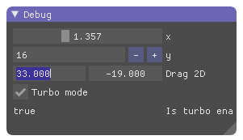

# imgui-ext¹

[](https://travis-ci.org/germangb/imgui-ext)
[](https://crates.io/crates/imgui-ext)
[](https://docs.rs/imgui-ext)
[](https://germangb.github.io/imgui-ext/)


A crate to quickly build [imgui](https://github.com/Gekkio/imgui-rs) UIs using annotations and a `derive` macro.

> ¹ The name `imgui-ext` follows the convention of adding an `-Ext` suffix to something that enhances an existing type. In this case, the imgui crate.

```rust
#[derive(imgui_ext::Gui)]
struct Example {
    #[imgui(slider(min = 0.0, max = 4.0))]
    x: f32,
    #[imgui(input(step = 2))]
    y: i32,
    #[imgui(drag(label = "Drag 2D"))]
    drag_2d: [f32; 2],
    #[imgui(checkbox(label = "Turbo mode"))]
    turbo: bool,
}

ui.window(im_str!("README.md"))
    .size((300.0, 100.0), ImGuiCond::FirstUseEver)
    .build(|| {
        ui.draw_gui(&mut example);
    });
```




## Examples

```bash
# codegen example (see examples/codegen.rs to see the code generated by the macro)
cargo run --example codegen

# several UI examples
cargo run --example ui

# integration with nalgebra types
cargo run --example nalgebra
```

[result]: assets/demo.png

## Limitations

* `#[derive(imgui_ext::Gui)]` is only supported for `struct`s with named fields.

## License

[MIT](LICENSE.md)
